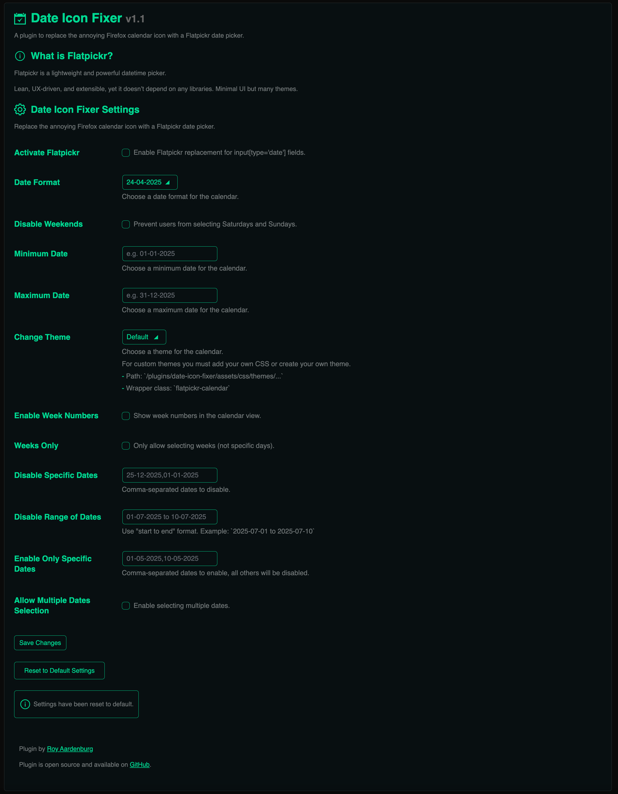
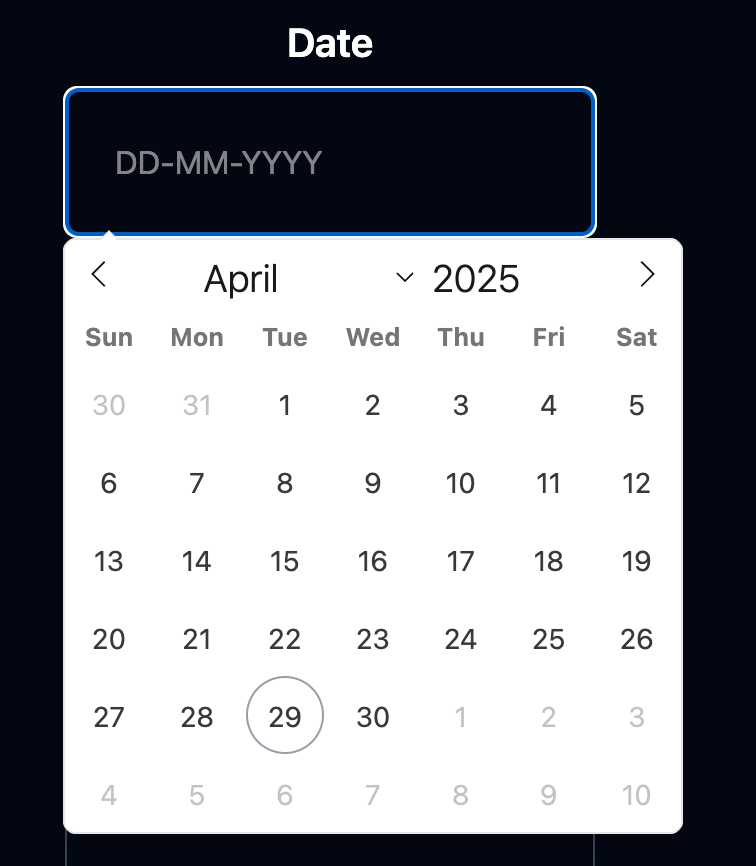

# Date Icon Fixer

**Date Icon Fixer** is a WordPress plugin that removes default calendar icons from HTML `<input type="date">` fields — especially that stubborn one in Firefox 😉.  
It replaces the native browser date pickers with [Flatpickr](https://flatpickr.js.org/), a lightweight and highly customizable JavaScript calendar.

Perfect if you're tired of inconsistent styling and want to deliver a more unified user experience across all browsers.

---

## Features

- ✅ Replaces native `<input type="date">` with Flatpickr
- ✅ Fully local (no external CDN required)
- ✅ Firefox-friendly — removes native icons completely
- ✅ Toggle the feature on/off from your WordPress dashboard
- ✅ Seamless integration with Contact Form 7
- ✅ Lightweight and customizable

---

## Installation

1. Upload the plugin files to the `/wp-content/plugins/date-icon-fixer` directory, or install the plugin directly through the WordPress plugins screen.
2. Activate the plugin through the 'Plugins' menu in WordPress.
3. Go to **Date Icon Fixer** to configure the plugin.

---

## Requirements

- WordPress 5.0 or higher
- PHP 7.4 or higher

---

## Screenshots

**Wordpress Admin**

**Preview**

---

## Frequently Asked Questions

**Can I fully customize the Flatpickr date selector?**
Yes, you can fully customize the date selector. Flatpickr allows you to adjust the appearance, behavior, and settings to fit your needs. You can change the date format, disable specific dates, add custom styles, and much more.

**Can I disable Flatpickr on certain forms?**  
Currently, the plugin replaces all date inputs site-wide. Fine-grained control may be added in future updates.

**Does this affect mobile browsers?**  
Yes. Mobile browsers will also use Flatpickr instead of the native date input, ensuring consistency.

---

## Changelog

### 1.0.0
- Initial release

---

## Credits

- Flatpickr by [@chmln](https://github.com/flatpickr/flatpickr)

---

## License

This plugin is licensed under the [GPLv2 or later](https://www.gnu.org/licenses/gpl-2.0.html).

---

## Author

Made by [Roy Aardenburg](https://royaardenburg.nl/)
